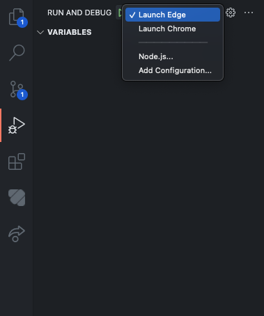

# sTUMatch Frontend

This repository contains the source code of the sTUMatch frontend.


## Getting Started

### Installing Packages

First of all, ensure that [NodeJS](https://nodejs.org/en/) is installed on your machine.
Then, clone the repository and install the packages:

```sh
git clone https://gitlab.lrz.de/seba-master-2021/team-29/frontend.git stumatch-frontend

cd stumatch-frontend
npm i
```


### Running the Application

Clone and run the [sTUMatch Backend](https://gitlab.lrz.de/seba-master-2021/team-29/backend)
repository (follow the instructions in its README for details).
Once the backend is running locally, you can start the frontend part of the application using your terminal:

```sh
npm run start
```

The command will start a local development server on port `8080`. To access the frontend, open
your favorite browser and navigate to [`localhost:8080`](http://localhost:8080).


### Debugging the Application with VS Code

The repository contains a launch configuration for [VS Code](https://code.visualstudio.com/)
and *Google Chrome*/*Microsoft Edge*. The configuration allows you to set breakpoints and debug
the code from VS Code.

To use the debugger, start the development server normally via `npm start`.
You can then, at any point in time, start a debugging session using `F5`.

You can select the browser which you want to use by selecting the respective debug configuration
in VS Code's debug workspace:


